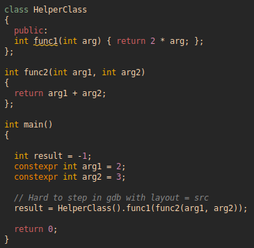
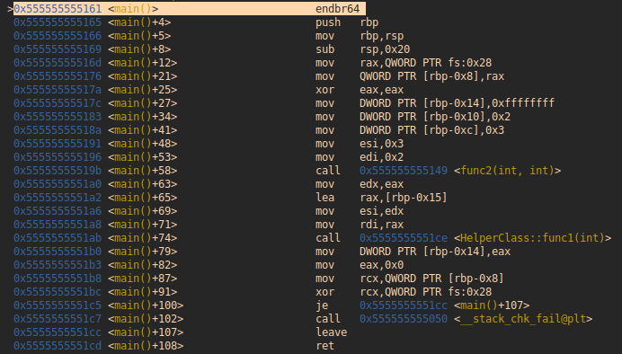

# Debugging with gdb in ROS1/ROS2 (C++)
KT 2023, Mallorca

Stefan Scherzinger
scherzin@fzi.de

---
### Goals of the workshop
- Give a **small introduction** to debugging with gdb for ROS (C++)
- Target **beginners** and intermediate users
- Share **14** of my frequently used **best-practices**
- Make you **curious** about gdb
- Show you at least **one thing** that you did not know

---
### Small hands-up
- Who has used gdb before?
- Who uses gdb regularly?
- Who uses another *formal* debugger?

---
### Why (still) use gdb in 2023?

Me:

```
Why should I learn gdb in 2023? (please be brief)
```

ChatGPT:
```
Learning gdb, the GNU Debugger, can help you to better understand and debug
your programs, especially when dealing with complex codebases or
hard-to-reproduce bugs. It is a powerful tool for analyzing program
execution, inspecting memory and variables, and identifying errors in your
code. Even as programming languages and development environments evolve, gdb
remains a valuable skill for software developers to have in their toolkit.
```

---
### Why (still) use gdb in 2023?
I'd like to add few points:

- It lets you debug without X server.
  *We are often working on shuttle PCs*

- It's extremely light-weight.
  *We don't want to configure an IDE on someone's PC*

- If you like the feeling of CLI.
  *Liking it results in using it more..*


---
## Agenda
I have **14** frequently used *best-practices* that fall into roughly three categories:
- Useful basics
- Common workflow in ROS1/ROS2
- Personal tips and tricks

---
## Useful basics

---
### #1 Use it
- `sudo apt install gdb` for installation

- `gdb <my-program>` to start it

- `q` to leave it

- `help <some-valid-command>` to look-up commands (very picky)

- `apropos <some-word>` better if you have only a vage idea

**Hint**:
It's extremely helpful to copy/paste content during debugging sessions. Check how to do that in your editor's gdb window!

---
### #2 Use the T(extual) UI
- `tui enable` and `tui disable` toggle a visualization of code
- `ctrl-l` redraw the screen if something looks weird
- `layout asm` change the code style. Options {src, asm, reg, ..}
- `focus cmd` has an effect on the arrow keys. Options {cmd, src, ..}
- `ctrl-x 2` alternates between double layouts
- `ctrl-x 1` switches back to a single layout

**Hint**:
Visualizing code makes navigation much more intuitive. Switch it off when requiring a longer command output.


---
### #3 Be comfortable with basic navigation
- `start` runs and breaks the program at *main()*
- `next` advance to the next line of code (approx.)
- `step` enter a function call (go one frame down)
- `finish` jump to the end of the current function
- `until 123` advance to line number 123 in the current file

**Hint**:
Most commands have short forms, like **s**tep and **n**ext.
*Enter* repeats the previous command.

---
### #4 Use breakpoints to navigate efficiently
- `break 123` creates a consistent breakpoint at line 123
- `tbreak 123` will break only once
- `continue` resumes the program until hitting the next break point
- `watch -l <some-variable>` reports when someone touches the variable's memory
- `i b` gives info on breakpoints
- `deactivate <b-nr>` keeps the break point but inactive
- `delete <b-nr>` removes it entirely from the list

---
### #5 Know how to inspect variables and memory
- `p <variable>` print the variable's content. Works with member variables, separated by `.`
- `x <address>` examine memory addresses. 
- `info locals` print all local variables in the current scope
- `ptype` print the definition of a type. Helpful to see class members.

**Hint**:
Both `p` and `x` support format options (`/x, /d, /t, /s...`) that change the output into hex, digital, binary, or string.


---
## Common workflow with ROS1/ROS2


---
### #6 Prepare a gdb session for ROS1/2
1. Build your code with debug symbols
```bash
# ROS1
catkin_make --pkg <your-package> -DCMAKE_BUILD_TYPE=Debug
# or
catkin build <your-package> --cmake-args -DCMAKE_BUILD_TYPE=Debug
```


```bash
# ROS2
colcon build --packages-select <your-package> --cmake-args -DCMAKE_BUILD_TYPE=Debug
```

---
### #6 Prepare a gdb session for ROS1/2

(Optional)
2. Install further ROS dependencies that you will need, e.g.
```bash
sudo apt install ros-noetic-controller-manager-dbgsym
#or
sudo apt install ros-humble-rclcpp-dbgsym
```

These system-wide debug libs seem to be used right away without rebuilding/sourcing your workspace.

An alternative is to git-clone and build these from source in your workspace. In that case, rebuild and source your workspace.


---
### #6 Prepare a gdb session for ROS1/2

4. Prepare a minimal *~/.gdbinit*:

```python
# Don't ask for confirmation for setting breakpoints in unknown files
set breakpoint pending on

# Don't break to acknowledge gdb's message: --Type <RET> for more, q to quit, c to continue without paging--
# This avoids manual delays when starting ROS1/2 nodes in gdb.
set pagination off

```

**Hint**: This makes sure that nodes start and run inside gdb without requiring a manual acknowledge.

---
### #7 Spawn your node of interest in gdb + screen
1. Pass `debug:=True` in ROS1 e.g.
```xml
  <!-- On/Off switch -->
  <arg name="debug" default="False" />
  <arg if="$(arg debug)" name="launch-prefix"
       value="screen -d -m gdb -command=$(env HOME)/.ros/my_debug_log --ex run --args"/>
  <arg unless="$(arg debug)" name="launch-prefix" value=""/>

  <!-- The node to debug -->
  <node name="my_node" pkg="my_pkg" type="my_node" output="screen" launch-prefix="$(arg launch-prefix)">

```

You might need to install screen first.
`sudo apt install screen`.

---
### #7 Spawn your node of interest in gdb + screen
2. Pass the `prefix` for ROS2 e.g.
```python
    my_node = Node(
        package="my_package",
        executable="my_node",

        # Comment when done with debugging
        prefix="screen -d -m gdb -command=/home/scherzin/.ros/my_debug_log --ex run --args",

        output={
            "stdout": "screen",
            "stderr": "screen",
        },
    )

```

---
### #7 Spawn your node of interest in gdb + screen

3. Pick the screen session up in any terminal (also via ssh)

```bash
screen -ls # shows possible other sessions
screen -r  # Picks the session up
```

4. Inside the screen session
```bash
ctrl-a d # detaches from the session
ctrl-a k # kills the session
```

**Hint**: The advantage is separating the *starting* terminal from the *debugging* terminal! I personally like picking the gdb session in *Neovim*.

---
### #8 Know how to attach gdb to a running stack
This is great when you don't want to interfer during startup and join later. It requires debug symbols, though.

1. Open gdb with sudo privileges (`sudo gdb` in some terminal)

2. Inside gdb, find the process of interest with e.g.
```bash
!pgrep -fa ros
# copy and paste the pid
attach <pid>
```

**Hint**: When quitting with `q`, gdb detaches from the process. So, you don't kill the process in this scenario.

---
### #9 Compose breakpoints for debugging sessions

1. Load breakpoints from a file that you keep somewhere. Check the file `~/.ros/my_debug_log` in #7.

2. Search for symbol names during a gdb session to get the fully qualified paths

```bash
info functions <my_func> # will find the symbol for <my_func>
```
Paste the paths into your debug file, e.g.
```
break rackki_simulation::MuJoCoSimulator::simulateImpl
```

---
### #9 Compose breakpoints for debugging sessions

**Hint**: Looking up symbols in gdb is very handy to get the full path right for the breakpoints. You can also save the breakpoints from gdb with
```bash
save breakpoints <your-file>
```
to check the format gdb uses. Use `pwd` and `cd` to navigate directories in gdb.

---
### #10 Be thorough and efficient when debugging

1. Don't assume, **confirm**!

2. Use a **top-down** approach (next before step)

---
## Personal tips and tricks


---
### #11 Navigate the call stack
On assembly level, there's *only* functions. All the program does is going through a nested chain of function calls.

 

When entering a function, gdb refers to it as a new **frame**.

---
### #11 Navigate the call stack
- `backtrace` or `bt` prints the call stack from the current execution up to *main()*
- `up`, `down` navigate the levels (frames) of the callstack
- `frame 7` switch directly to frame 7
- `until 123` continue execution on the *current* level until line 123

**Hint**: The `until` command works like a *continue on this level!* In contrast, the *next* and *step* commands continue where you previously stopped the execution, no matter which frame you are looking at. Use `until +1` to jump right after the calling function for convenience.


---
### #12 Navigate precisely on assembly level
Nested function calls make it difficult to step into the code of interest.
```c++
  16
  17  // Hard to step in gdb with layout = src
> 18  result = func1(func2(std::make_shared<HelperClass>()));
  19
```

1. Have these consistently in your *~/.gdbinit*:
```bash
# Intel convention is my thing
set disassembly-flavor intel

# Show symbols in human readable form
set print asm-demangle on
```

---
### #12 Navigate precisely on assembly level
2. Switch to the corresponding assembly code with `layout asm` 

3. You can recognize the function frames via the *call* instructions, e.g.
```c++
0x5555555551ab <main()+74>    call   0x5555555551ce <HelperClass::func1(int)>
```

4. Use `ni`, `si` (*i* stands for instruction) to navigate.

5. Use `finish` to jump out of a function frame and right to the next instruction after it. Gdb will also print the return value from that function which is good for debugging.

---
### #12 Navigate precisely on assembly level
**Hint**: Instead of hitting `ni` 100 times to get to your function, you can also use the *until* command with memory addresses, e.g.
```gdb
   until *main+74
   until *0x5555555551a8
```

---
### #13 Navigate between threads
- `info threads` lists all threads of the process you debug
- `thread 5` jump to thread 5 (and start navigating there)
- `until +1` continue with the current frame's next line
- `thread apply all bt` print the callstack for each thread
  (*set pagination off* for this)

**Hint**: Put `set non-stop on` in `~/.gdbinit` if you want gdb to *only break* the current thread. Letting other threads run in parallel might be indisposable for some applications.

---
### #14 Use core files for bugs that are difficult to reproduce
1. Spawn the application with gdb + screen
2. Wait for the crash and generate a core file from gdb with `generate-core-file`. It ends up in `pwd`.
3. For debugging (do that any time), start gdb and
```bash
file <executable>  # will read the symbols from the crashed exe
core-file <core-file>  # will read the memory dump
```
You can now inspect the call stack for suspicious values.

---
### #14 Use core files for bugs that are difficult to reproduce
**Hint**: When debugging the *core file* later on a different pc, you'll also need the *executable* with debug symbols. Check the file with `ldd -r <executable>` and try to replace the `undefined symbols` of the relevant dependencies by creating or installing dependencies.


---
## Summary and take home message
- Practice the *Basics* and spend time in gdb
  E.g. **build small toy programs and try stuff**
- Use the *Workflow for ROS1/2* and look around in your nodes
- Use gdb for *your next* bug!
- You'll learn and improve your game!

---
## Further reading
- Use `help` and `apropos` in gdb!
- The official [gdb manual](https://www.sourceware.org/gdb/documentation/)
- Great introductory book:
  *The Art of Debugging with GDB, DDD and Eclipse*

- *Greg Law's* talks on Youtube.

---
